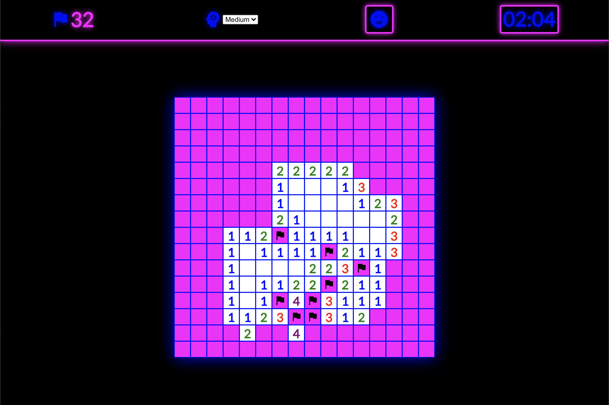
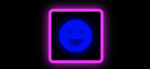
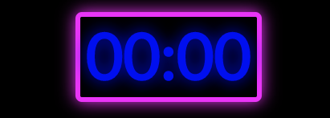
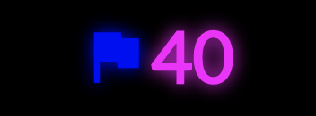
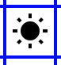
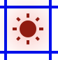
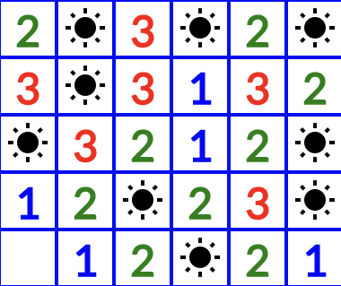
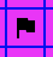
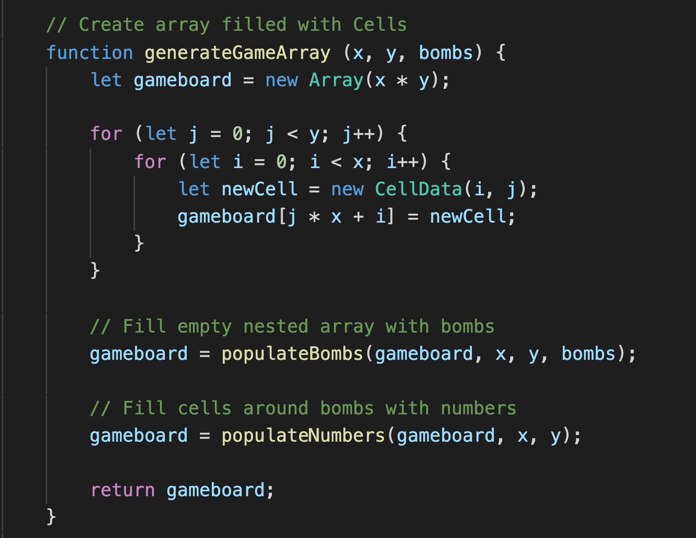
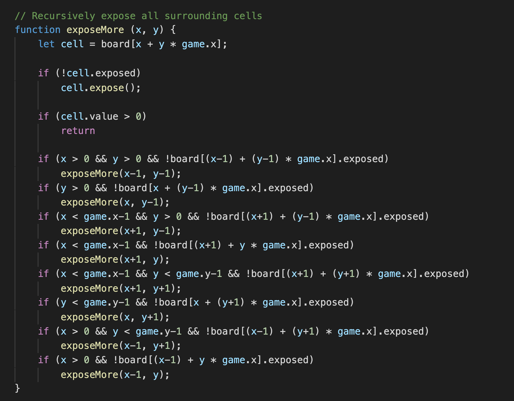

# Minesweeper

### Developed with **React** and **Sass** by John Teckemeyer

---

---

## Table Contents

- [Overview](#overview)
- [Getting Started](#getting-started)
- [How To Play](#how-to-play)
  - [The Menu](#the-menu)
  - [Select Skill Level](#select-skill-level)
  - [Restart Game](#restart-game)
  - [Timer](#timer)
  - [Flag Counter](#flag-counter)
  - [Mines](#mines)
  - [Proximity Indicators](#proximity-indicators)
  - [Flags](#flags)
- [Code](#code)
  - [Creating The Gameboard](#creating-the-gameboard)
  - [Exposing The Cells](#exposing-the-cells)

---

---

## Overview

---

_Minesweeper_ is a single-player game in which the objective is to clear a rectangular grid of cells by avoiding those with mines and revealing all empty cells. Any empty cell can show a number indicating the quantity of mines surrounding it. It is with these numbers that the player can use logic to deduce the locations of the mines. The game ends when either the player reveals a mine or has cleared all empty cells.

---

---

## Getting Started

Play
[Minesweeper here](https://TheTeck.github.io/Minesweeper2/)

##### No setup necessary, just start clicking on the board!

---

---

## How To Play

---

### _The Menu_:

  
The game menu is located at the top of the game board. In it, the player game see how many flags they have left to play and how much time (in seconds) has passed in the game. There are also controls for setting the difficulty of the game as well as restarting the game.

---

### _Select Skill Level_:

  
You may change the skill level of the board by selecting either "Easy", "Medium" or "Hard" from the drop-down list. Increasing the difficulty increases the size of the board as well as the ratio of mines to empty spaces. "Easy" skill level has a 10x10 board with 10 mines, "Medium" skill level has a 16x16 board with 40 mines, and "Hard" skill level has a 16x30 board with 99 mines.

---

### _Restart Game_:

  
You may restart the game at any time by simply pressing the restart button. Both the flag count and timer reset when game is restarted.

---

### _Timer_:

  
Located to the far-right of the menu is the game timer. It indicates the number of seconds that have passed since the first click on the board. The timer stops when the player either wins or loses.

---

### _Flag Counter_:

  
Located to the far-left of the menu is the flag counter. It indicated how many flags remain available for the player to use in the game.

---

### _Mines_:

   
Randomly scattered across the board are the mines. If you reveal one by left-clicking on it, it will detonate and end the game as a loss.

---

### _Proximity Indicators_:

  
As the cells become revealed, some will have numeric values indicating the quantity of mines that are in adjacent proximity of it. These values help deduce the locations of mines.

---

### _Flags_:

  
The player starts with a number of flags equal to the number of mines hidden on the board. The player may choose to use the flags to indicate the location they believe a mine to be. When a flag is place, that cell cannot be revealed. The player can remove any placed flag and reuse it on another cell. Flags are placed and removed with the right mouse button.

---

---

## Code

---

### _Creating The Gameboard_:

### _Exposing The Cells_:

